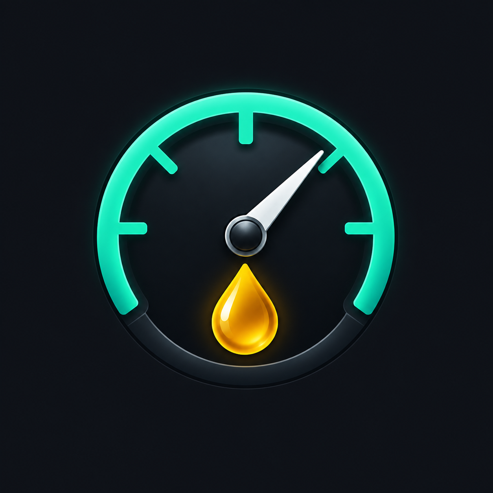

# Pressure Monitor

Demo de una app Flutter para visualizar presión de aceite o combustible de un vehículo.



## Estado actual

Los valores se generan dentro de la app. Esta versión NO recibe mediciones reales: BLE, firmware ESP32-S3 y calibración quedan pendientes. Los ajustes no persisten al reiniciar.

## Funciones

- Dashboard oscuro con lectura en PSI o bar.
- Gráfico de los últimos 30 segundos.
- Selección de aceite o combustible.
- Simulación de presión normal/baja, fallo de sensor y desconexión.
- Umbral configurable y pausa del simulador.

## Ejecutar

Instala Flutter stable y las herramientas Android, conecta un teléfono con depuración USB y ejecuta:

```sh
flutter pub get
flutter run
```

## Verificar

```sh
flutter analyze
flutter test
```

## Iconos y APK

```sh
dart run flutter_launcher_icons
flutter build apk --release
```

El APK se genera en `build/app/outputs/flutter-apk/app-release.apk` y no se versiona. La configuración inicial usa la firma de desarrollo; preparar una firma propia antes de publicar en una tienda.

## Archivos

- `lib/main.dart`: interfaz y simulador del MVP.
- `assets/icon/pressure-icon.png`: icono de la app.
- `flutter_launcher_icons.yaml`: configuración de iconos.
- `android/` e `ios/`: configuración nativa (iOS aún no verificado).
- `test/widget_test.dart`: prueba de arranque y desconexión simulada.

## Próximo paso

Integrar BLE entre un teléfono y un ESP32-S3 que envíe valores simulados, antes de conectar el sensor físico.

